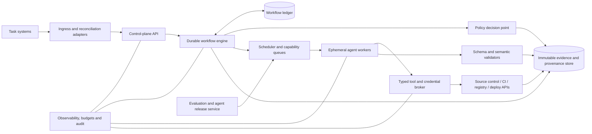

# Production Autonomy Roadmap

Status: proposed  
Last reviewed: 2026-08-30  
Scope: evolve this repository from a governed VS Code agent starter into a production-grade, policy-bounded software delivery platform.

## Outcome

The target system can take eligible work from a trusted ticket snapshot through analysis, implementation, independent review, pull request, merge, release, progressive deployment, verification, and recovery without routine human intervention.

"Fully autonomous" does not mean unconstrained. It means autonomous inside a pre-authorized risk envelope:

- deterministic controllers, not language models, own state transitions and privileged actions;
- every action is authenticated, authorized, scoped, recorded, and reversible where practical;
- agents cannot expand their permissions, approve their own work, alter protected policy or evaluation thresholds, erase audit history, or bypass failed gates;
- ambiguous, irreversible, novel, high-blast-radius, and out-of-policy work stops for a human decision;
- humans retain ownership of risk appetite, trust roots, policy exceptions, emergency control, and critical-incident accountability.

The current repository is an MVP specification and developer-side execution kit. The VS Code custom agents remain useful as the reasoning and interaction layer, but a durable control plane is required for production autonomy. Agent chat history must never be the authoritative workflow state.

## Current baseline and gaps

| Area | Present now | Required for production |
| --- | --- | --- |
| Agent reasoning | 13 VS Code custom agents with scoped roles | Versioned agent registry, typed invocation protocol, isolated workers, budgets, identity, promotion and rollback |
| Orchestration | Prompt-driven delivery orchestrator and documented stages | Durable state machine, queue, scheduler, leases, retries, reconciliation, cancellation, replay and recovery |
| Contracts | Four closed JSON schemas | Complete protocol/schema registry, semantic cross-contract validation, migrations and compatibility guarantees |
| Integrations | Task-board, source-control and evidence interface documents | Authenticated, conformance-tested adapters with webhooks, idempotency, rate limits and reconciliation |
| Evidence | Local ignored `.delivery/` records and CI artifacts | Signed, immutable, content-addressed evidence ledger and complete provenance graph |
| CI | Contract, project and PR metadata checks | Trusted non-bypassable checks, real stack checks, security suite, merge-queue support and workflow tests |
| Release | Build-once digest skeleton | Signed artifact, SBOM, provenance, trusted run verification, registry and retention policy |
| Deployment | Placeholder staging and production steps | Real progressive-delivery adapters, SLO gates, post-deploy verification and automatic rollback |
| Testing | Nine framework tests plus configurable project commands | Unit, integration, end-to-end, fault, security, adversarial, agent-evaluation, load, soak and disaster-recovery suites |
| Operations | Short operations and threat-model documents | Telemetry, SLOs, alerting, runbooks, backup/restore, incident response, capacity, cost and support model |
| Governance | Markdown policies and human production approval | Enforceable policy-as-code, risk classification, separation of duties, exception records and audit export |

Two existing mechanisms must be treated as blockers, not production controls:

1. `scripts/run_configured_checks.py` executes pull-request-controlled command strings with `shell=True`. A change can weaken its own gates. Production CI needs a trusted, signed check/plugin registry and isolated execution.
2. The current metadata check proves that PR fields contain text, not that referenced evidence exists, validates, is signed, and belongs to the current head SHA.

## Autonomy model

Autonomy is granted per repository, workflow, action, environment, and risk tier. It is never a single global switch.

| Level | Capability | Human involvement |
| --- | --- | --- |
| L0 — Advisory | Analyze and recommend; current starter | Humans perform all mutations |
| L1 — Supervised build | Create a branch and draft PR in a sandbox | Human approves execution and merge |
| L2 — Autonomous PR | Eligible tickets progress to a reviewed, green PR | Human merges |
| L3 — Autonomous non-production | Merge eligible PRs and deploy to ephemeral/staging environments | Human approves production |
| L4 — Bounded production | Canary, verify, promote or roll back pre-authorized low-risk changes | Humans handle exceptions and high-risk work |
| L5 — Agent-managed operations | Routine delivery, dependency maintenance, triage and recovery are managed continuously | Humans govern policy, risk and emergency control |

Initial risk tiers should be deterministic and policy-controlled:

| Tier | Examples | Maximum automatic authority |
| --- | --- | --- |
| R0 — Informational | Documentation, comments, generated metadata | Merge after required checks |
| R1 — Low | Small reversible code change with no sensitive data, public API, infrastructure or migration impact | Merge, canary, promote and roll back under L4 policy |
| R2 — Moderate | Internal API changes, bounded dependency updates, feature-flagged behavior | Automatic PR and staging; production only with explicitly approved policy |
| R3 — High | Authentication, authorization, secrets, infrastructure, public contracts, regulated data, costly resources | Human approval before merge and production |
| R4 — Restricted | Destructive migration, trust-root or policy change, broad deletion, irreversible external action | Manual execution or a separately approved runbook |

Risk classification must consider repository criticality, data sensitivity, blast radius, reversibility, migration scope, public compatibility, security-control impact, infrastructure scope, cost exposure, confidence of tests, and novelty. An agent may recommend a tier, but the policy engine computes and enforces the effective tier.

## Target architecture



Authoritative state belongs in the workflow engine and database. Immutable evidence belongs in content-addressed object storage. The agent layer supplies analysis and candidate decisions; it does not directly grant authority.

Privileged operations stay behind small deterministic controllers:

| Controller | Sole authority | Required preconditions |
| --- | --- | --- |
| Workflow controller | Advance or stop durable state | Valid transition, current version, policy decision and recorded intent |
| Merge controller | Merge the exact eligible head SHA | Fresh trusted checks, independent reviews, signed evidence and merge-queue revalidation |
| Deployment controller | Deploy an attested artifact digest | Environment policy, staging evidence, change window, error budget and deployment lock |
| Rollback controller | Restore a previously verified artifact or disable a feature | Triggered runbook, bounded target and preserved incident evidence |
| Containment controller | Pause work, revoke capabilities and freeze merge/deploy paths | Security signal or authorized operator action; it cannot grant access |
| Evidence verifier | Accept evidence into the provenance graph | Schema, semantics, identity, signature, timestamp, digest and tenant checks |

## Roadmap at a glance

Durations are planning ranges for a team of roughly 5–8 experienced engineers with security, SRE and product support. Phases overlap where dependencies allow. A focused first production target—one source-control provider, one task board, one runtime stack and one deployment platform—is approximately 12–18 months. Broad enterprise and multi-platform support is likely 18–24 months.

| Milestone | Outcome | Estimated effort | Autonomy reached |
| --- | --- | --- | --- |
| M0 — Honest and safe foundation | No placeholder can masquerade as a gate; project has a governed baseline | 2–4 weeks | L0 |
| M1 — Protocol and policy foundation | Every state, message, decision and artifact has a versioned contract | 4–6 weeks | L0 |
| M2 — Durable execution core | Work survives restarts and retries without duplicate effects | 8–12 weeks | L1 |
| M3 — Real integrations and evidence | One conformance-tested ticket-to-PR path works end to end | 8–12 weeks | L2 |
| M4 — Specialist agent system | Risk-selected agents complete and review representative work | 8–12 weeks | L2 |
| M5 — Security and evaluation gate | Agent, model and tool changes are measurable and promotable safely | 8–12 weeks | L2/L3 |
| M6 — Deterministic delivery | Signed artifacts progress through canary, verification and rollback | 8–12 weeks | L3/L4 |
| M7 — Production operations | SLOs, recovery, incident response and cost controls are proven | 6–10 weeks | L4 |
| M8 — GA and agent-managed operations | Multi-tenant governance and continuous safe operation | 8–12 weeks plus continuous work | L5 |

Critical path:

```text
M0 autonomy boundary and trusted gates
  -> M1 schemas, state model and policy vocabulary
    -> M2 durable runtime + sandbox + policy enforcement
      -> M3 real connectors + immutable evidence
        -> M4 supervised ticket-to-PR
          -> M5 evaluation, shadow and canary qualification
            -> M6 bounded merge and progressive delivery
              -> M7 soak, recovery and operational readiness
                -> M8 GA and graduated autonomy
```

The schema registry, runtime, evidence service, sandbox, adapter framework and evaluation corpus should be developed as parallel workstreams after M0, with explicit integration gates.

## M0 — Honest and safe foundation

Goal: make the repository safe to adopt as a starter and remove any false signal of production readiness.

| ID | Task | Completion evidence |
| --- | --- | --- |
| FND-001 | Publish the autonomy definition, risk tiers, prohibited actions and human break-glass responsibility. | Approved policy and transition matrix cover every privileged action. |
| FND-002 | Add `LICENSE`, `CONTRIBUTING.md`, `SECURITY.md`, `CODEOWNERS`, support policy, versioning policy and ADR template. | Repository governance files pass an automated completeness check. |
| FND-003 | Inventory every placeholder, mock, `echo`, permissive default and manual step; fail configuration validation when a production profile still contains one. | A production-profile fixture with any placeholder is rejected. |
| FND-004 | Replace mutable shell command strings with a trusted check registry of argument arrays or signed plugins. Run checks in an egress-denied sandbox and prohibit a PR from changing the definition used to judge itself. | A malicious PR cannot replace a required check with `true`, inject shell syntax, or select an untrusted executable. |
| FND-005 | Strengthen PR metadata validation to resolve evidence, validate schemas and signatures, and bind ticket, review, checks and artifact references to the exact current head SHA. | Missing, stale, unsigned, malformed and cross-repository evidence fixtures fail. |
| FND-006 | Test `pull_request`, `pull_request_target`, fork, merge-queue, stale-head and rerun behavior. Keep privileged workflows on trusted base code and never execute untrusted checkout with write tokens. | Workflow security tests exercise every event and permission boundary. |
| FND-007 | Replace no-op type, integration and security checks in the starter example with real checks, or make them explicitly unavailable and blocking in production mode. | A deliberately broken example fails each corresponding job. |
| FND-008 | Complete the Task API reference application, including generated evidence, CI, artifact, ephemeral deployment, smoke test and rollback demonstration. | A fresh clone follows one documented command path from ticket fixture to verified staging. |
| FND-009 | Expand the threat model into assets, actors, trust boundaries, abuse cases and a control/owner/test matrix. | Threat review includes ticket, logs, code, model, MCP/tool, CI, runner, artifact, deploy and operator boundaries. |
| FND-010 | Pin supported Python, JSON Schema, Actions runner and VS Code/Copilot versions; add a compatibility matrix. | CI covers the declared matrix and fails unsupported combinations clearly. |
| FND-011 | Add repository hygiene checks for generated caches, accidental secrets, binary artifacts, dead links and untracked example outputs. | Clean checkout and release source contain only intended files. |
| FND-012 | Label all current deploy flows as simulations until a real adapter is configured. | Documentation and job summaries cannot imply a placeholder deployed software. |

Exit gate: the starter can be published as an honest `v0.2` developer preview. All existing checks are meaningful, the reference example is reproducible, and no privileged workflow evaluates untrusted code with privileged credentials.

## M1 — Protocol, schema and policy foundation

Goal: make every runtime object and boundary machine-readable, versioned and semantically verifiable.

| ID | Task | Completion evidence |
| --- | --- | --- |
| CON-001 | Adopt a controlled schema namespace, JSON Schema 2020-12 validator and schema registry with immutable versions. | Standards conformance, invalid-fixture and fuzz tests pass. |
| CON-002 | Define `work-item`, `workflow-definition`, `workflow-event`, `stage-attempt`, `transition-command`, `lease`, `checkpoint`, `cancellation`, `budget` and `decision` schemas. | Every workflow transition consumes and emits a validated envelope. |
| CON-003 | Define `agent-manifest`, `agent-invocation`, `agent-result`, `agent-error`, `agent-event`, `context-item`, `tool-grant` and `tool-call-receipt` schemas. | Agent conformance kit rejects undeclared tools, incompatible schemas and incomplete results. |
| CON-004 | Define `ticket-snapshot`, `repository-map`, `impact-analysis`, `implementation-plan`, `test-plan`, `test-result`, `change-set`, `finding`, `remediation` and `ci-diagnosis` schemas. | The planning/build/review chain is typed end to end. |
| CON-005 | Define `pull-request-state`, `merge-decision`, `release-manifest`, `deployment`, `verification`, `rollback` and `incident` schemas. | SCM and delivery controllers accept no free-form privileged command. |
| CON-006 | Define `risk-assessment`, `policy-decision`, `approval`, `exception`, `evidence-envelope`, `provenance`, `attestation`, `audit-event`, `evaluation-case`, `evaluation-result` and `agent-release` schemas. | Every authority grant and evidence record is attributable and signed. |
| CON-007 | Upgrade the existing four contracts with work ID, ticket digest, producer identity, timestamps, subject digest, schema/policy/agent versions and content-addressed references. | Old documents migrate explicitly; silent reinterpretation is impossible. |
| CON-008 | Implement semantic validation across contracts: requirements coverage, design traceability, current SHA, fresh review/checks, resolved findings, authorized waivers and identical staging/production digest. | Cross-document mutation tests fail at the correct invariant. |
| CON-009 | Publish OpenAPI for synchronous control APIs and AsyncAPI or equivalent event definitions; generate SDK types rather than hand-copying interfaces. | Client and server compatibility tests run in CI. |
| CON-010 | Define additive-change, deprecation, migration and support-window rules for schemas, workflows, agents, policies and connectors. | CI detects breaking changes and requires a migration plus owner approval. |
| CON-011 | Create a stable error taxonomy with retryability, severity, operator action and safe user message. | Every failure maps to a documented code; raw provider/model errors do not drive workflow policy. |
| CON-012 | Define canonical JSON, digest, signature, timestamp and clock-skew rules. | Independent implementations produce and verify identical subject digests. |
| CON-013 | Define `connector-manifest`, `connector-capabilities`, `normalized-webhook-event`, `idempotent-command`, `provider-error` and `connector-health` schemas. | Every adapter passes a provider-neutral protocol suite. |
| CON-014 | Define `repository-catalog-entry`, `service-catalog-entry`, `environment-manifest`, `dependency-edge`, `multi-repo-change-set`, `rollout-wave` and `compatibility-report` schemas. | Cross-repository and deployment topology is explicit and digest-linked. |
| CON-015 | Define `tenant`, `principal`, `role-binding`, `policy-bundle`, `quota`, `data-classification`, `privacy-impact`, `retention-policy`, `data-residency-policy`, `sli`, `slo`, `alert`, `runbook` and `postmortem` schemas. | Tenancy, privacy and operations can be enforced without free-form interpretation. |

Required work-item invariants:

- every run pins workflow, policy, schema, agent, prompt, tool and model versions;
- exactly one active writer lease exists for a repository/worktree;
- every review and release acts on an immutable commit and tree digest;
- state change and outbound intent are recorded atomically;
- at-least-once delivery produces exactly-once observable effects through idempotency and reconciliation;
- all retries, remediation loops, costs, tokens, tool calls and wall time are bounded;
- a production change is reversible or carries a time-bound, subject-bound exception;
- stale ticket, branch, PR, CI, review or deployment evidence stops progress.

Exit gate: publish `v0.3-protocol`. A separate implementation can pass the conformance suite without relying on prose or agent conversation history.

## M2 — Durable control and execution plane

Goal: turn orchestration from a prompt into a recoverable distributed system.

| ID | Task | Completion evidence |
| --- | --- | --- |
| RUN-001 | Select and document the workflow engine, database, queue, object store, policy engine, sandbox and tenancy model in ADRs. Prefer a proven durable engine unless a custom PostgreSQL state machine is justified. | Failure-mode and operations review approves each choice. |
| RUN-002 | Implement APIs to create, inspect, pause, resume, cancel, supersede and replay work. | Authenticated API and CLI pass lifecycle tests. |
| RUN-003 | Implement the version-pinned state machine from intake through completion, with explicit waiting and terminal states. | Golden transition tests cover every valid and invalid edge. |
| RUN-004 | Store an append-only transition ledger with monotonic sequences and optimistic concurrency. | Competing transitions cannot advance the same item twice. |
| RUN-005 | Implement transactional inbox/outbox delivery and stable idempotency keys for all external intent. | 10,000 replayed workflows create no duplicate visible effects. |
| RUN-006 | Add capability queues, fair scheduling, repository locks, priorities, deadlines, tenant/provider quotas and admission control. | A 10x-peak load test shows no starvation or lock violation. |
| RUN-007 | Add worker leases, heartbeats, checkpointing, cancellation propagation, timeouts, bounded retries, jitter and dead-letter quarantine. | Force-killing a worker at each stage loses no work and respects budgets. |
| RUN-008 | Reconcile provider state before retrying writes; implement compensations for branch, PR, preview environment and deployment operations. | Timeout-after-success fixtures do not duplicate side effects. |
| RUN-009 | Build an immutable agent registry with capabilities, schemas, tool allowlist, model constraints, resource limits and escalation behavior. | Scheduler cannot route an incompatible or revoked agent. |
| RUN-010 | Run each invocation in an ephemeral rootless sandbox at an exact commit with deny-by-default filesystem and network access. | Escape, persistence and cross-job isolation tests pass. |
| RUN-011 | Route every external operation through a typed tool gateway; issue short-lived invocation-, resource-, action- and environment-scoped credentials. | Workers have no ambient task-board, SCM or cloud credentials. |
| RUN-012 | Compile context from content-addressed sources with origin, trust and sensitivity labels; quarantine untrusted instructions from tickets, logs, comments and code. | Prompt-injection fixtures cannot gain tool authority or contaminate trusted memory. |
| RUN-013 | Add model gateway routing, version pinning, provider fallback policy, token/cost budgets, rate limits and kill switches. | Fallback is an explicit recorded policy decision, never an invisible retry. |
| RUN-014 | Validate and redact every result before it can change state or enter durable storage. | Invalid schema, secret leakage and taint-policy violations quarantine the invocation. |
| RUN-015 | Support workflow-version migration for long-lived work and safe runtime rolling upgrades. | In-flight work survives a control-plane upgrade and can roll back. |

Suggested main states:

```text
INGESTED -> TRIAGED -> REQUIREMENTS -> DESIGN -> PLANNED
-> BUILDING -> VERIFYING -> REVIEWING <-> REMEDIATING
-> PR_OPEN -> CI_WAIT -> MERGE_READY -> MERGED
-> RELEASED -> STAGING -> PRODUCTION_CANARY
-> PRODUCTION -> POST_VERIFY -> COMPLETED
```

Cross-cutting waits: `WAITING_DECISION`, `WAITING_DEPENDENCY`, `RATE_LIMITED`, `PAUSED`. Terminal states: `FAILED`, `CANCELLED`, `QUARANTINED`, `ROLLED_BACK`, `SUPERSEDED`.

Exit gate: publish `v0.4-runtime-alpha`. A workflow resumes after a total process restart without chat history, duplicate effects or lost evidence.

## M3 — Integrations and immutable evidence

Goal: operate one real, least-privilege ticket-to-PR path and preserve an independently verifiable history.

| ID | Task | Completion evidence |
| --- | --- | --- |
| INT-001 | Define a connector SDK and conformance kit for authentication, capabilities, pagination, webhooks, retries, idempotency, reconciliation, rate limits and error mapping. | Provider simulators verify success, duplicate, reorder, timeout, 429, 5xx and revocation behavior. |
| INT-002 | Implement a GitHub App source-control connector for branch, commit, draft PR, check/status and merge-readiness operations. Keep approval, ruleset mutation and deployment outside its grant. | Installation-scoped permissions and webhook reconciliation pass security review. |
| INT-003 | Implement GitHub Issues as the first task adapter, then Jira and Linear adapters behind the same contract. | Ticket snapshots are immutable, revisioned, digest-bound and drift-detected. |
| INT-004 | Implement CI providers beginning with GitHub Actions; add GitLab CI and Jenkins only after the contract is stable. | Checks are tied to provider run ID, trusted workflow identity and exact head SHA. |
| INT-005 | Implement an artifact registry adapter supporting immutable digest lookup, signature, SBOM and retention. | Tag mutation cannot substitute the promoted artifact. |
| INT-006 | Implement an evidence service using canonicalized, content-addressed objects, signed envelopes and append-only/WORM retention. | Changed bytes, conflicting keys and overwritten records are detected or rejected. |
| INT-007 | Store claims separately from externally observed evidence and create a queryable ticket-to-deployment provenance graph. | An offline verifier reconstructs the complete chain. |
| INT-008 | Implement a secrets and workload-identity broker using short-lived OIDC credentials, rotation and revocation. | No long-lived secret appears in prompts, workspaces, logs or artifacts. |
| INT-009 | Implement notification adapters for decisions, policy denials, incidents and completion; do not use chat as the system of record. | Notifications are deduplicated and link to authoritative state. |
| INT-010 | Implement preview-environment and deployment interfaces, beginning with one target such as Kubernetes/GitOps. | Create, inspect, promote, verify, roll back and clean up pass conformance tests. |
| INT-011 | Add repository onboarding and toolchain discovery with an explicit generated profile that owners review. | Unknown commands or permissions fail closed; discovery cannot silently enable writes. |
| INT-012 | Add webhook replay protection, signature verification, ordering tolerance, periodic reconciliation and backfill. | Dropped and reordered event tests converge to provider truth. |
| INT-013 | Add adapter health, quotas, latency, cost and provider-outage circuit breakers. | Provider degradation pauses safely without retry storms. |
| INT-014 | Define retention, backup, restore, legal hold, export and deletion rules for each data class. | Restore and tenant-scoped export/delete drills pass. |

Exit gate: publish `v0.5-supervised-beta`. At least 100 representative low-risk tickets reach correctly reviewed PRs in shadow/supervised operation with zero duplicate branches/PRs and zero stale-SHA approvals.

## M4 — Specialist agent system and autonomous PR workflow

Goal: use small, independently evaluated agents selected by task risk and evidence needs.

### Required core agents

| Agent | Responsibility | Hard boundary |
| --- | --- | --- |
| Intake/Triage | Readiness, duplicates, dependencies, scope and risk recommendation | Cannot mutate a ticket or lower effective risk |
| Repository Onboarder/Cartographer | Ownership, architecture, build, test, deploy and dependency map | Read-only; generated profile requires approval |
| Requirements Analyst | Testable requirements and unresolved decisions | Cannot invent product decisions |
| Impact/Dependency Analyst | Callers, consumers, compatibility and multi-repo impact | Read-only |
| Solution Architect | Design options, ADRs, boundaries and failure modes | Cannot approve its own design exception |
| Implementation Planner | Ordered tasks, file ownership, parallelization and merge plan | Cannot grant tools or execute changes |
| Builder Coordinator | Dispatch bounded implementation tasks and integrate results | Cannot review, merge or deploy |
| Test Strategist/Generator | Acceptance coverage, negative, property, integration and failure tests | Generated tests are independently mutation-tested |
| Correctness Reviewer | Logic, data integrity, concurrency and compatibility | Independent context and credentials |
| Security/AppSec Reviewer | Auth, input, data flow and abuse-path review | Cannot waive findings |
| Reliability/SRE Reviewer | Failure behavior, telemetry, capacity and recovery | Cannot change SLO gates |
| Remediation Coordinator | Convert findings into bounded builder tasks | Capped cycles; cannot dismiss findings |
| CI Investigator | Classify failures and propose bounded repair | Cannot blindly rerun or hide the original failure |
| Evidence Auditor | Verify freshness, signatures, traceability and completeness | Read-only; deterministic verifier remains authoritative |
| Release Readiness | Explain readiness and residual risk | Advisory; controller owns release decision |
| Post-Deploy Verifier | Interpret predefined telemetry and test evidence | Cannot override a failed deterministic gate |
| Incident Triage | Gather evidence and recommend rollback/mitigation | Emergency controller owns actuation |
| Workflow Supervisor | Diagnose stuck, costly or looping work | Cannot bypass policy or force a transition |

### Risk-activated specialists

- API and backward-compatibility specialist;
- database, migration, backfill and data-integrity specialist;
- infrastructure-as-code and cloud-architecture specialist;
- distributed-systems and microservices specialist;
- performance, load and capacity specialist;
- observability and SLO specialist;
- privacy, retention, residency and compliance specialist;
- IAM and authorization specialist;
- threat-modeling specialist;
- prompt-injection and tool-safety specialist;
- supply-chain, dependency and license specialist;
- runtime/container/Kubernetes security specialist;
- accessibility, UX, frontend and mobile specialists for relevant repositories;
- documentation and developer-experience specialist;
- FinOps and model-cost specialist;
- vulnerability triage and patch specialist;
- red-team/evaluation-case generator;
- model/prompt/tool change reviewer;
- audit and compliance evidence specialist;
- multi-repository change coordinator.

Agent implementation tasks:

| ID | Task | Completion evidence |
| --- | --- | --- |
| AGT-001 | Convert each Markdown persona into a versioned manifest plus prompt/template package with typed inputs, outputs, tools, budgets and escalation rules. | Registry and compatibility checks pass. |
| AGT-002 | Define deterministic activation rules from risk, changed paths, languages, architecture and data classifications. | Every benchmark activates the expected minimum independent set. |
| AGT-003 | Separate builder and reviewer context, workspaces, identities and model invocations. | A builder cannot author or tamper with its review evidence. |
| AGT-004 | Build bounded fan-out/join orchestration and conflict resolution for specialist findings. | Contradictory or incomplete reviews stop for resolution. |
| AGT-005 | Enforce requirement-to-design-to-test-to-evidence traceability. | Every acceptance criterion has externally checkable evidence. |
| AGT-006 | Add bounded remediation with fresh commit, checks and independent re-review after material changes. | Stale approvals cannot survive a fix; loop caps are enforced. |
| AGT-007 | Implement draft-to-ready PR lifecycle, CI diagnosis, merge-readiness and ticket status updates. | Representative low-risk work reaches a policy-complete PR without operator recovery. |
| AGT-008 | Create stack profiles for at least TypeScript/Node, Python, JVM, Go, .NET and infrastructure repositories over time. | Each supported profile has a maintained reference project and CI matrix. |
| AGT-009 | Make agent failure explicit: succeeded, retryable failure, permanent failure, needs decision, quarantined or cancelled. | Free-form success text cannot advance a stage. |
| AGT-010 | Add confidence calibration and abstention rules; never treat confidence alone as approval evidence. | Low-support conclusions consistently request evidence or stop. |

Exit gate: publish `v0.6-autonomous-pr`. On a representative benchmark, at least 95% of eligible low-risk tasks reach a correct, independently reviewed PR without runtime/operator recovery; critical hidden tests and policy suites have zero escapes.

## M5 — Security, supply chain and evaluation

Goal: make autonomy measurable, adversarially tested and enforceable outside prompts.

### Security and governance work

| ID | Task | Completion evidence |
| --- | --- | --- |
| SEC-001 | Implement default-deny policy-as-code at every mutation, credential issue, state transition, merge, deployment and exception boundary. | Policy conformance suite covers allow, deny, decision and quarantine outcomes. |
| SEC-002 | Add RBAC/ABAC for humans and workload identity for services; enforce tenant, repository, path, action, environment and time scopes. | Cross-tenant and privilege-escalation tests pass. |
| SEC-003 | Enforce separation of duties between builder, reviewers, release controller, deploy controller and policy administrator. | No single identity can author, approve and promote the same subject. |
| SEC-004 | Add secret scanning, DLP, structured redaction, sensitive-context minimization and retention controls before model calls and persistence. | Seeded secrets never reach model/provider logs or durable evidence. |
| SEC-005 | Add SAST, SCA, dependency provenance, license, IaC, container, API and dynamic security gates appropriate to each stack. | Deliberately vulnerable reference changes fail the expected gate. |
| SEC-006 | Generate SBOMs, signed provenance and artifact attestations; verify signatures and issuer/workflow identity before promotion. | Artifact substitution and untrusted-workflow fixtures fail. |
| SEC-007 | Harden runners and build toward SLSA Build L2, then L3 where the build platform supports it. | Threat-modelled build isolation and provenance requirements are audited. |
| SEC-008 | Add tamper-evident audit, key rotation, trust-root recovery, vulnerability disclosure, patch SLAs and incident response. | Tabletop, key-rotation and audit-integrity exercises pass. |
| SEC-009 | Commission independent penetration testing and agentic red-teaming before production authority. | No unresolved critical/high finding remains at GA; accepted exceptions are scoped and expiring. |
| SEC-010 | Protect workflow, policy, schema, agent and evaluation changes with CODEOWNERS, trusted CI and separate promotion. | Agents cannot change the rules or tests governing their own release. |

### Evaluation platform work

| ID | Task | Completion evidence |
| --- | --- | --- |
| EVA-001 | Build versioned real, synthetic, regression, adversarial and hidden task corpora with deterministic sandboxes. | Every state, agent, integration, risk tier and failure class is represented. |
| EVA-002 | Score requirement fidelity, correctness, security, reliability, test quality, review precision/recall, diff minimality, policy compliance, latency, cost and intervention rate. | Baselines and release thresholds are versioned. |
| EVA-003 | Add malicious tickets/comments, poisoned code/logs, secret traps, stale evidence, artifact substitution, flaky CI, provider failures and conflicting reviewers. | Critical safety suites require 100% pass; scores cannot average away a safety failure. |
| EVA-004 | Use mutation testing and seeded defects to measure generated tests and reviewer detection. | Minimum detection thresholds are met per supported stack. |
| EVA-005 | Record sealed inputs for offline replay and compare candidate agent, prompt, model and tool versions. | Every candidate produces a reproducible comparison report. |
| EVA-006 | Add shadow mode, canary routing, automatic rollback, version pinning and provider-fallback evaluation. | Promotion requires statistically meaningful evidence within quality, latency and cost budgets. |
| EVA-007 | Protect benchmark truth, hidden cases and thresholds from delivery agents. | Attempts to inspect or modify protected evaluation data are denied and audited. |
| EVA-008 | Turn escaped defects, incidents, false approvals and false blocks into protected regression cases. | Incident closure requires a reproducer or documented non-reproducibility decision. |

Exit gate: publish `v0.7-qualified-beta`. At least 500 representative end-to-end cases pass; all critical permission, prompt-injection, stale-evidence and artifact-integrity suites pass 100%; candidate releases show no critical regression and remain inside approved cost/latency bounds.

## M6 — Deterministic CI, release and progressive delivery

Goal: let eligible changes reach production while promoting the exact verified artifact and failing safely.

| ID | Task | Completion evidence |
| --- | --- | --- |
| DEL-001 | Replace repository-defined arbitrary shell checks with trusted reusable workflows or sandboxed signed plugins. Record tool versions, inputs and outputs. | A PR cannot weaken, skip or forge its own required checks. |
| DEL-002 | Add merge-group/queue support, current-head reconciliation and deterministic merge authorization by a dedicated controller. | A changed head or obsolete queue result invalidates approval. |
| DEL-003 | Build once in a trusted workflow, create release manifest, SBOM, signature, provenance and durable attestation, and push by immutable digest. | Offline verification binds ticket, commit, workflow, artifact and registry record. |
| DEL-004 | Authenticate the successful source workflow/run through the provider API and trusted workflow identity, not user-supplied run IDs or text files alone. | Cross-repository, wrong-event and untrusted-workflow artifacts are rejected. |
| DEL-005 | Create ephemeral preview environments with TTL, isolation, seed data controls, deterministic smoke/integration tests and cleanup. | Leaked-resource and cleanup reconciliation tests pass. |
| DEL-006 | Implement deployment plan/diff, policy check and environment lock before mutation. | Unexpected scope, cost or blast radius stops before apply. |
| DEL-007 | Implement canary or blue/green delivery with feature flags, predefined health/SLO queries and progressive traffic steps. | Gates are deterministic and evidence-bound; agents only interpret diagnostics. |
| DEL-008 | Implement automatic rollback, roll-forward and circuit breaker with bounded retries. | A seeded critical regression begins rollback within the target window. |
| DEL-009 | Add safe database workflow: compatibility checks, expand/contract, backups, resumable backfill, verification and rollback/forward plan. | Migration failure and partial-backfill drills preserve integrity. |
| DEL-010 | Add dedicated hotfix, incident, rollback, vulnerability-remediation, dependency-update and release-train workflows. | Each path has tested authority, evidence and recovery semantics. |
| DEL-011 | Support multi-repository change sets with dependency order, compatibility windows and compensating rollback. | Partial-success scenarios converge safely or quarantine. |
| DEL-012 | Enforce change windows, environment freezes, maintenance budgets and global/repository/workflow kill switches. | Operators can pause or revoke autonomy without losing state. |

Exit gate: publish `v0.8-bounded-production`. Low-risk changes can merge, deploy to canary, promote or roll back under policy. High-risk and out-of-policy changes reliably stop. Staging and production always use the same verified artifact digest.

## M7 — Observability, SRE and operational readiness

Goal: operate the platform as a dependable production service rather than a collection of workflows.

| ID | Task | Completion evidence |
| --- | --- | --- |
| OPS-001 | Instrument OpenTelemetry traces, metrics and structured logs across work, stage, agent, model, tool, policy, connector and deployment boundaries. | One trace reconstructs a ticket-to-production path without exposing secrets. |
| OPS-002 | Track queue depth, stuck work, lease loss, transition errors, retry rate, model/tool latency, policy denials, evidence failures, quality, escaped defects, token/cost and deployment health. | Dashboards have owners, targets and actionable alerts. |
| OPS-003 | Define service and workflow SLOs, error budgets and customer-facing status semantics. | SLO review drives release and autonomy policy. |
| OPS-004 | Add synthetic workflows and continuous reconciliation for every critical connector and deployment target. | Silent integration drift is detected before user work is lost. |
| OPS-005 | Implement backup, point-in-time restore, object-store recovery, key recovery and regional disaster recovery. | Scheduled restore drills prove declared RPO/RTO. |
| OPS-006 | Run load, soak, chaos, queue-loss, worker-loss, database-failover, object-corruption, provider-outage and regional-recovery tests. | All failure classes recover or quarantine within SLO without duplicate effects. |
| OPS-007 | Create runbooks for stuck workflow, cost spike, credential compromise, prompt injection, evidence failure, provider outage, bad agent release, deployment regression and data loss. | On-call exercises resolve seeded incidents using the runbooks. |
| OPS-008 | Add capacity planning, quotas, model/provider spend controls, per-work budgets, anomaly detection and chargeback/showback. | A runaway task cannot exceed its hard budget or starve other tenants. |
| OPS-009 | Build operator UI/API for timeline, evidence, decisions, pause/resume, cancellation, quarantine, safe redrive, rollback and audit export. | Operators do not need database or runner access for routine recovery. |
| OPS-010 | Establish on-call ownership, severity model, escalation, communications, postmortem and support SLAs. | Production-readiness review and incident tabletop pass. |

Suggested initial targets, to be tuned from pilot data:

- workflow/control-plane availability at least 99.9%;
- ledger/evidence RPO no more than 5 minutes and RTO no more than 30 minutes;
- cancellation reaches active workers within 60 seconds;
- critical production-gate breach begins rollback within 5 minutes;
- no unbounded workflow, retry, remediation or cost loop;
- 30 days of representative soak without lost work or unreconciled side effects.

Exit gate: publish `v0.9-production-candidate`. Operational, security, backup/restore and failover reviews are signed off with measured evidence, not document-only assertions.

## M8 — GA, enterprise controls and agent-managed operation

Goal: graduate autonomy using production evidence and manage routine operation through the same governed system.

| ID | Task | Completion evidence |
| --- | --- | --- |
| GA-001 | Add organization/tenant isolation, SSO/OIDC/SAML as needed, SCIM, RBAC/ABAC, quotas, encryption boundaries and audit export. | Cross-tenant isolation and offboarding tests pass. |
| GA-002 | Add data classification, residency, retention, consent, deletion, legal hold and model-provider routing policies. | Privacy impact assessment and deletion/export drills pass. |
| GA-003 | Package reproducible installation and upgrades with Helm/Terraform or equivalent, database migrations, rollback and compatibility checks. | Fresh install, upgrade from supported versions and rollback pass in CI. |
| GA-004 | Publish APIs, SDKs, connector authoring guide, operator/developer documentation, compatibility matrix and support lifecycle. | A new team onboards without undocumented maintainer steps. |
| GA-005 | Add policy packs and evidence reports mapped to the organization’s applicable controls; do not claim certification without an external audit. | Control owners can trace each policy to enforcement and test evidence. |
| GA-006 | Complete independent architecture, security, privacy, accessibility, reliability and disaster-recovery reviews. | No unresolved release-blocking finding remains. |
| GA-007 | Graduate autonomy by repository and risk tier using shadow, supervised, canary and production outcome evidence. | Approval records show why each scope received L2, L3, L4 or L5 authority. |
| GA-008 | Add governed maintenance workflows for dependencies, vulnerabilities, documentation drift, flaky tests, cost optimization and stale resources. | Routine maintenance creates the same evidence and independent review as feature work. |
| GA-009 | Add governed agent self-management: propose agent/prompt/model/tool/policy changes, evaluate, review, shadow, canary, promote and roll back. | No in-place self-editing; protected policies and benchmarks require independent authority. |
| GA-010 | Add model/provider failover and deprecation workflows with quality, privacy, availability and cost gates. | Provider loss degrades safely without silent model substitution. |
| GA-011 | Publish signed releases, changelog, upgrade advisories, vulnerability process and long-term-support policy. | Release artifacts and source are independently verifiable. |
| GA-012 | Establish product metrics and quarterly governance review for autonomy benefit, false decisions, incidents, cost and user trust. | Autonomy is reduced automatically when its error budget is exhausted. |

Exit gate: publish `v1.0`. The system meets every GA gate below for its declared support matrix. L5 is granted only to scopes with sufficient production evidence; unsupported scopes remain at a lower autonomy level.

## Required workflow catalog

Each workflow needs a versioned state definition, risk policy, schemas, timeout/retry budget, compensations, evidence requirements, owner and end-to-end tests.

- repository onboarding and capability discovery;
- ticket intake, deduplication, readiness and drift reconciliation;
- normal feature/bug ticket-to-PR;
- API/contract change and consumer compatibility;
- database migration and resumable backfill;
- infrastructure plan/apply and drift reconciliation;
- dependency update and license review;
- vulnerability triage, emergency patch and disclosure handling;
- CI failure diagnosis and bounded repair;
- preview environment create/verify/destroy;
- release train, artifact publication and promotion;
- canary, blue/green, feature-flag rollout and rollback;
- hotfix and production incident response;
- multi-repository coordinated change;
- documentation-only and policy-exempt low-risk change;
- model, prompt, agent, tool, schema, workflow and policy upgrade;
- scheduled maintenance, stale resource cleanup and cost optimization;
- autonomy graduation, suspension and revocation.

## Integration support order

Do not build every provider at once. Stabilize the connector contract with one production path, then expand.

1. GitHub App + GitHub Issues + GitHub Actions + one artifact registry + one Kubernetes/GitOps target.
2. Jira and Linear task adapters; Slack/Teams/email decision notifications.
3. GitLab source control/CI and Jenkins CI.
4. Major cloud identity, secrets, registry and deployment providers.
5. Observability providers, feature-flag systems, incident platforms and service catalogs.

Every adapter must pass the same conformance suite, use least-privilege short-lived identity, expose a capability document, reconcile webhooks with provider truth, preserve idempotency, respect rate limits, redact sensitive data, emit OpenTelemetry data and support revocation.

## Definition of production-ready and GA gates

The following are release gates, not aspirations. Initial numeric targets should be tuned using pilot data without weakening the safety invariants.

### Correctness and autonomy

- At least 500 representative end-to-end evaluation cases cover all supported agents, workflows, integrations, states, failure modes and risk tiers.
- Critical policy, permission, prompt-injection, secret, stale-evidence and artifact-substitution suites pass 100%.
- At least 100 representative shadow/supervised tickets reach the correct disposition before production authority is enabled.
- At least 100 consecutive eligible low-risk changes complete ticket-to-production without human action, unauthorized effects, stale evidence, duplicate effects or escaped critical defects before L5 is claimed.
- Eligible workflow completion is at least 95%, excluding declared external-provider outages; runtime/operator recovery is separately measured and driven down.
- Review precision/recall, false-block rate, escaped-defect rate, latency and cost meet versioned thresholds for every supported stack.

### Security and supply chain

- Tool permissions are enforced outside prompts and every privileged side effect has a signed policy decision and receipt.
- No production worker has ambient long-lived credentials; short-lived identity and revocation are tested.
- Build artifacts have SBOM, signature, provenance and attestation; deployment verifies issuer, workflow, commit and digest.
- No unresolved critical/high penetration-test or threat-model finding exists, except a formally accepted, scoped and expiring exception.
- Policy, workflow, schema, agent and evaluation changes cannot self-approve.
- A complete ticket-to-production provenance chain verifies offline and survives retention/restore drills.

### Reliability and operations

- A 30-day representative soak loses no state and leaves no unreconciled external effect.
- Load at 10x expected peak meets queue, latency, fairness and cost objectives.
- Worker, queue, database, object store, credential broker, model provider, connector and region failures recover or quarantine within SLO.
- Backup/restore, regional recovery, key rotation, credential compromise, bad agent release and production rollback exercises pass.
- Alerts, runbooks, on-call, incident communications, postmortems, capacity plans and support ownership are active.

### Product and governance

- The supported platform/provider/version matrix is explicit and continuously tested.
- Installation, upgrade, rollback, tenant offboarding, audit export and data deletion are reproducible.
- Every autonomy grant has an owner, scope, expiry/review date, evidence, error budget and immediate kill switch.
- High-risk, ambiguous, irreversible and out-of-policy work reliably stops for a decision.
- Documentation makes unsupported behavior and residual risk clear; marketing claims match measured capability.

## Issue template for roadmap execution

Create one issue per task ID with these required fields:

- milestone and task ID;
- user/operator outcome;
- scope and explicit non-goals;
- risk tier and threat-model links;
- owner and independent reviewer;
- dependencies and blocked-by IDs;
- affected schemas, policies, agents, workflows and integrations;
- migration and compatibility plan;
- acceptance criteria and machine-verifiable evidence;
- unit, integration, end-to-end, adversarial, fault and load tests as applicable;
- telemetry, SLO and cost impact;
- rollout, feature flag, canary and rollback plan;
- documentation and runbook changes;
- final evidence links bound to the merged commit.

## Parallel workstreams and ownership

A practical delivery organization is:

- control plane and workflow runtime;
- sandbox, identity, policy and security;
- schemas, evidence and supply chain;
- connectors and developer platform;
- agents, evaluation and supported stack profiles;
- release, deployment and SRE;
- product experience, documentation and governance.

The milestone owner maintains the dependency graph and evidence dashboard. Independent security and reliability owners can block promotion. No workstream can waive its own release gate.

## Standards and reference points

Use current versions and record the exact version adopted in an ADR:

- [VS Code custom agents](https://code.visualstudio.com/docs/agent-customization/custom-agents) and [subagents](https://code.visualstudio.com/docs/agents/run/subagents) for the developer interaction layer;
- [NIST AI Risk Management Framework and Generative AI Profile](https://www.nist.gov/itl/ai-risk-management-framework) for governance and risk framing;
- [OWASP agentic AI threats and mitigations](https://genai.owasp.org/resource/agentic-ai-threats-and-mitigations/) for agent-specific abuse cases;
- [SLSA](https://slsa.dev/spec/v1.2/about), [GitHub artifact attestations](https://docs.github.com/en/actions/concepts/security/artifact-attestations) and [Sigstore verification](https://docs.sigstore.dev/cosign/verifying/verify/) for software-supply-chain provenance;
- [CycloneDX](https://cyclonedx.org/guides/sbom/) for SBOM representation;
- [OpenTelemetry semantic conventions](https://opentelemetry.io/docs/specs/semconv/) for interoperable telemetry.

## Immediate next sprint

Start with these tasks in order:

1. `FND-001`: approve autonomy/risk definitions and prohibited actions.
2. `FND-004`: remove the self-modifiable shell-command trust boundary.
3. `FND-005` and `FND-006`: make evidence and GitHub event handling trustworthy.
4. `FND-003`, `FND-007` and `FND-012`: make placeholders fail closed and claims honest.
5. `FND-008`: finish the executable Task API reference path.
6. `CON-001`, `CON-002`, `CON-003` and `CON-006`: establish protocol/schema foundations.
7. Write the workflow-engine, policy-engine, sandbox, evidence-store and identity ADRs before runtime implementation.

That sprint produces the trustworthy foundation on which parallel runtime, connector, evidence and evaluation work can begin.
